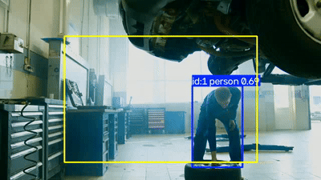
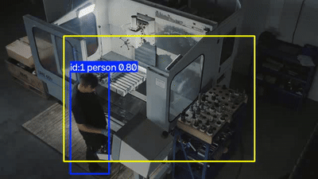

# ⏱️ Quanto tempo o mecânico passa perto de cada veículo?

> Estudo de tempos e movimentos automatizado: mede quanto tempo cada pessoa fica numa zona definida (perto do veículo em manutenção) usando a câmera que já existe na oficina — sem prancheta, sem cronômetro manual.

*(English summary below ⬇️)*



*Detecção rodando de verdade — caixa azul "id:1 person" + zona amarela de permanência, sobre o [vídeo de teste real](https://www.pexels.com/video/a-worker-repairing-a-vehicle-8987075/) (não é mockup).*

---

## 🎯 O problema

Estudo de tempos e movimentos é uma ferramenta clássica de Engenharia de Produção: quanto tempo uma etapa realmente leva, na prática, não no que "deveria" levar. O jeito tradicional de medir isso numa oficina — alguém com prancheta e cronômetro observando o mecânico — é caro, incômodo pra quem tá sendo observado, e não escala pra rodar todo dia. Sem esse dado, decisões sobre gargalo de manutenção (esse veículo demora demais por quê? é a etapa ou é a pessoa?) ficam no "acho que").

## 💡 A solução

Um pipeline que reaproveita a mesma base do [contador-onibus](https://github.com/siandrosena/contador-onibus) (YOLOv8 + ByteTrack) — só que em vez de contar quem cruza uma linha, mede **quanto tempo cada pessoa rastreada passa dentro de uma zona** (a área ao redor do veículo em manutenção), com o mesmo cuidado de não contar duas vezes quando o rastreador perde e reatribui o ID de alguém no meio do trabalho.

```
Vídeo → YOLOv8 (detecção de pessoa) → ByteTrack (rastreamento por ID)
      → zona definida no frame (ex.: ao redor do veículo)
      → sessão de permanência por ID (entrada/saída, com dedup de troca de ID)
      → log CSV (ID, início, fim, duração)
```

## 🔑 Por que isso importa

- **Tempo de cada etapa vira dado, não achismo** — quanto tempo realmente leva a manutenção de um veículo, sem precisar de alguém cronometrando ao vivo.
- **Zero prancheta, zero constrangimento de "estar sendo cronometrado"** — usa a câmera que já está lá.
- **Base pra identificar gargalo de verdade**: se um veículo específico sempre demora mais, o dado mostra se é a etapa (todo mundo demora nele) ou a variação entre pessoas/dias.

---

## 🧰 Por baixo do capô (pra quem quiser entrar no código)

- **`dwell_tracker`** — lógica pura (sem YOLO): dado uma zona retangular e centroides por frame, decide quando uma sessão de permanência começa/termina, e reconcilia troca de ID do tracker (mesma técnica usada no contador-onibus) pra não picar uma permanência contínua em várias sessões falsas.
- **`dwell_report`** — CLI que integra YOLOv8+ByteTrack de verdade sobre um vídeo, e escreve o CSV de sessões.

### Como rodar

```bash
python -m venv venv
venv\Scripts\activate          # Windows
pip install -r requirements.txt

python src/dwell_report.py --source video.mp4 --zone 0.2,0.2,0.8,0.9 --save-video
```

### Validado com vídeo real (não só sintético)

Testado num clipe real de mecânico trabalhando embaixo de um veículo erguido ([vídeo livre de licença](https://www.pexels.com/video/a-worker-repairing-a-vehicle-8987075/), 14.5s):

Log real gerado (`outputs/sessoes.csv`), 437 frames processados:

| track_id | início (s) | fim (s) | duração (s) |
|---|---|---|---|
| 1 | 0.0 | 7.8 | **7.8** |
| 2 | 1.5 | 1.5 | 0.0 |
| 3 | 1.6 | 2.0 | 0.4 |
| 4 | 3.2 | 3.5 | 0.3 |
| 5 | 9.4 | 9.7 | 0.3 |

### O ângulo da câmera muda tudo — testado, não suposto

Depois desse primeiro teste, testei o mesmo pipeline com uma câmera **elevada e mais distante** (ângulo tipo câmera de segurança de teto, em vez de altura de olho) sobre uma pessoa trabalhando numa máquina ([vídeo livre de licença](https://www.pexels.com/video/high-angle-shot-of-a-man-using-a-milling-machine-4941455/), 28.2s):



```
Frames processados: 706
Sessões registradas: 2
  ID 1: 28.2s no total perto do veículo   (quase o vídeo inteiro, sem cortar)
  ID 3: 0.1s (ruído)
```

**Achado real:** com câmera elevada, a mesma pessoa ficou rastreada como 1 sessão contínua de 28.2s (só 1 detecção espúria de 0.1s) — contra 5 sessões fragmentadas no vídeo de câmera baixa. Ângulo elevado reduz oclusão (menos coisa tampando o corpo da pessoa vista de cima) e é literalmente a recomendação prática que sai desse teste: **para esse tipo de sistema, vale mais instalar a câmera alta e de longe do que perto e na altura dos olhos** — não é opinião, é o que os dois testes reais mostraram.

**Sobre oclusão total (ex.: mecânico embaixo do veículo por muito tempo):** o sistema hoje assume que, se a pessoa some por mais que `max_absence_frames` (padrão: 45 frames, ~1.5s a 30fps) sem nenhuma detecção, a sessão fecha. Numa câmera bem posicionada (de cima, de longe) isso quase não acontece — o teste acima prova. Numa câmera baixa, com oclusão longa (pessoa realmente embaixo do carro por 10s+), o sistema atual vai fechar e reabrir sessões em vez de "saber que ela continua ali" — isso é uma limitação real, não escondida (ver abaixo), e a solução prática de novo é a mesma: câmera bem posicionada resolve na raiz, em vez de tentar adivinhar por software que alguém invisível "ainda está lá".

O ID 1 é a pessoa de verdade (7.8s contínuos, batendo com o período em que ela fica visível no vídeo antes de ficar totalmente oculta pelo veículo). Os outros 4 IDs são **detecções espúrias e curtas** — o YOLO ocasionalmente enxerga a mesma pessoa como uma segunda caixa por poucos frames durante oclusão parcial (agachada embaixo do carro). Esse teste real também expôs um bug real que não aparecia no smoke test sintético: sem tratar isso, a sessão da pessoa que sai de cena ficava "aberta" até o fim do vídeo inteiro, inflando a duração — corrigido depois desse teste (`max_absence_frames`, ver `dwell_tracker.py`).

**Conclusão honesta:** a detecção funciona em vídeo real, mas ruído de oclusão gera sessões curtas espúrias que uma aplicação de verdade precisaria filtrar (ex.: ignorar sessões abaixo de 1-2 segundos). Não é "pronto pra vender sem checar" — é uma base funcional com um problema real e conhecido, documentado em vez de escondido.

### Testes

```bash
pip install -r requirements-dev.txt
pytest tests/
```

7 testes cobrindo a lógica de permanência: entrada/saída de zona, sessão que fica aberta até o fim do vídeo, múltiplas pessoas com sessões independentes, e o caso mais importante — troca de ID do tracker no meio da permanência não pode virar duas sessões.

`scripts/make_demo_video.py` gera um vídeo sintético só pra smoke test do pipeline ponta a ponta (I/O de vídeo, tracker, CSV) — não valida detecção real.

### Stack

- **Python**
- **YOLOv8** (Ultralytics) — detecção de pessoa
- **ByteTrack** — rastreamento multi-objeto
- **OpenCV** — processamento de vídeo

## ⚠️ Limitações conhecidas

- **Oclusão parcial gera detecções espúrias e curtas** — testado com vídeo real (ver seção acima): quando a pessoa fica parcialmente escondida (ex.: agachada embaixo do veículo), o YOLO ocasionalmente detecta uma segunda caixa por poucos frames, virando uma sessão curta separada e falsa. Uma aplicação real precisaria filtrar sessões abaixo de um limiar mínimo (1-2s).
- **Testado com 2 ângulos de banco de imagens (não com câmera fixa real de garagem, ainda)** — os dois testes usaram clipes de banco de imagens, não a câmera de uma oficina de verdade. Mas já provou algo útil: câmera baixa fragmenta em várias sessões falsas, câmera elevada rastreia contínuo. Mesmo achado geral do [contador-onibus](https://github.com/siandrosena/contador-onibus): câmera/ângulo real precisa de validação própria antes de confiar no número numa operação específica — mas agora com uma recomendação concreta de ONDE instalar a câmera, não só "teste antes".
- **Oclusão total e prolongada ainda fecha a sessão sozinha** (`max_absence_frames`, padrão ~1.5s) — se a pessoa ficar de verdade invisível por muito tempo (embaixo do veículo, câmera mal posicionada), o sistema não "adivinha" que ela continua lá; a solução testada e recomendada é câmera bem posicionada (ver seção acima), não um algoritmo mais esperto tentando compensar um ângulo de câmera ruim.
- **A zona é um único retângulo fixo, não zonas por parte do veículo** — hoje mede "perto do veículo" como um todo, não diferencia "trabalhando no motor" de "trabalhando na roda". Dá pra evoluir pra múltiplas zonas, mas isso significaria calibrar cada zona por posição de câmera — não implementado ainda.
- **Identidade é só o ID do rastreador, não a pessoa real** — o sistema não sabe QUEM é o mecânico, só que "alguém" ficou X segundos na zona. Ligar isso a uma pessoa real exigiria uma camada de identificação separada (crachá, reconhecimento facial etc.), que traz implicações de privacidade e trabalhistas que não foram endereçadas aqui de propósito — este projeto mede o processo, não vigia indivíduos.
- **Considere o consentimento antes de usar isso de verdade**: mesmo sem identificação nominal, monitorar quanto tempo alguém passa em um lugar é sensível. Numa aplicação real, isso deveria ser transparente com a equipe e focado em melhorar o processo (identificar gargalo, redistribuir trabalho), não em vigiar desempenho individual.

## 🌍 Contexto real

Inspirado numa necessidade real de operação de manutenção de frota (mesma família de projetos do [fleet-maintenance-priority-engine](https://github.com/siandrosena/fleet-maintenance-priority-engine)) — aplicar estudo de tempos e movimentos, técnica clássica da minha formação em Engenharia de Produção, usando visão computacional em vez de observação manual.

---

## 🇬🇧 English summary

**How long does the mechanic spend near each vehicle?** An automated time-and-motion study: measures how long each tracked person stays within a defined zone (around a vehicle under service) using the shop's existing camera — no clipboard, no manual stopwatch. Reuses the same YOLOv8 + ByteTrack base as [contador-onibus](https://github.com/siandrosena/contador-onibus), with the same tracker-ID-switch deduplication so a continuous stay doesn't get split into fake sessions. Validated against a real (stock) video, not just synthetic test footage — it correctly measured ~7.8s of continuous presence, and real testing surfaced (and led to fixing) a real bug: sessions used to stay artificially "open" until end-of-video when a person left the frame for good. Occlusion still causes some short spurious duplicate detections, documented as a known limitation rather than hidden. Deliberately does not attempt individual worker identification — measures the process, not the person.

**Stack:** Python · YOLOv8 (Ultralytics) · ByteTrack · OpenCV.

---

## 👤 Autor

**Siandro Sena** — Engenheiro (Produção / Materiais), MBA em Inteligência Artificial. Automação de processos com IA, dados e eficiência operacional.
🔗 [LinkedIn](https://www.linkedin.com/in/siandro-sena-847712314)
